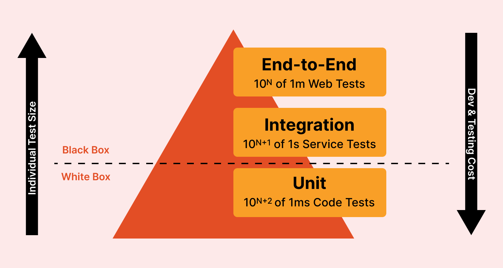

# Testing Srtategy

Our definition of tests:

## System under test, collaborators and classes without Unit Tests
- Our system under test will be a class with behaviour and surely all the classes without behaviour 
  which are part of the behaviour.
- If we have a class with behaviour which is used by the System under test, we will call it "collaborator"
- Collaborators will be system under tests and they will have their own tests

## Acceptance tests

- An acceptance test will be a set of tests, end to end, which will tests in the closest way to the
  user interaction with our system/application.
- We could decide to use fake objects, for example for the database, or other kind of strategies
  because of performance improvements. This kind of strategies could be:
	- Using wrappers when we are going to interact with external systems. And use fake objects
	- To be less complex the interaction with database, we could use a fake object or a light
          database as for example sqlite or a database in memory.
	- The tests with the boundaries, will be called integration tests.

This decisions should be correctly documented in the testings strategy (specific decisions section) 
with PROS and CONS and benefits. 

The reasons should be based on solving problems with the feedback loop, 

## Integration test

For us, integration test are test which test the interaction with a external system, as for example,
the database or endpoints.

Usuarly we will use the repository pattern or wrappers to encapsulate the interaction.

## Unit tests

Our unit tests will be test which check the behaviour of a system under test, usually an object or
a set of objects.

Unit tests don't test collaborators

## The test pyramid

For us, we will have more test for unit tests. We will test the isolated behaviour of the system
under test (usually a class) without the collaborators. We will use doubles of test to simulate the
behaviour.

Our Integration tests will test only the correct integration with the extenal system. They usually are 
slow test, above all when the interaction is with a database.

In case of external endpoints, the integration will be with wiremock. We will asume if we call the 
endpoint correclty, the integration will be correct.

The acceptance test, will be the slowest test. We will create happy path and some edge tests, covering
the main interactions of the user with the system

